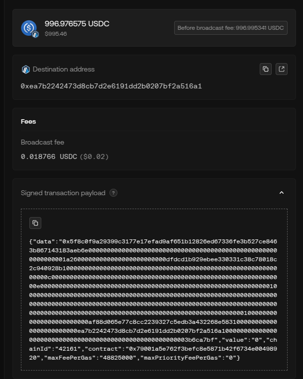

---

title: CCM Swaps to EVM

description: Description of CCM swaps to EVM chains.

---

import { Callout } from "@/components";

## CCM Swaps to EVM Chains

### EVM Considerations

Besides the general [implementation checklist](cross-chain-messaging#implementation-checklist), there are some specific considerations for EVM chains.
- The gas limit on the destination chain (EVM) will be capped to 10 million gas.
- The receiver contract on the destination chain must implement the `cfReceive` function specified in [this section](#smart-contract-interface---receive-call-and-asset-on-the-receiver-contract-ccm).
- If the amount of gas requested (`gas_budget`) is not enough to cover the gas costs of the receiver's logic on the destination chain, the transaction won't be broadcasted. An example of a gas estimation is provided [below](#gas-budget-estimation).
- In the event of a transaction not being broadcasted due to insufficient gas, the signed payload will be available for the user to broadcast as described [here](#ccm-broadcast-failure).

### CCM Receiver Smart contract interface 

Chainflip's Vault will transfer the destination token amount to the specified address either within the same call (for native token) or by transferring the ERC20 token to it. Then it will call the destination address with the following parameters:

| Param       | Description | Data Type |
| ----------- | ----------- | --------- |
| `srcChain`  | Source [chain ID](../vault-swaps/vault-swaps.mdx#supported-chain-and-asset-notation) for the swap. | `uint32`   |
| `srcAddress`| Address that initiated the swap on the source chain. Addresses are encoded into a bytes type. | `address` |
| `message`   | Message that is passed to the destination address on the destination chain.. | `bytes`    |
| `token`     | Address of the token transferred to the receiver. A value of `0xEeee...eeEEeE` represents the native token. | `address` |
| `amount`    | Amount of the destination token transferred to the receiver. If it's the native token, the amount value will equal the `msg.value`. | `uint` |

In order for a contract to be a valid receiver it **must implement the Solidity function signature** below on the destination address.

```solidity
function cfReceive(
    uint32 srcChain,
    bytes calldata srcAddress,
    bytes calldata message,
    address token,
    uint256 amount
) external payable;
```

It's the receiver's responsibility to correctly implement the function's interface and to ensure the call doesn't revert. If the receiver can't guarantee that the receiving logic won't revert, it is recommended to use try/catch-like structure to handle the reversion. This is to avoid the full transaction reverting and therefore the tokens failing to be transferred.

<Callout>
<span style={{color: 'red', fontWeight: 'bold'}}>IMPORTANT!</span>
Chainflip will transfer tokens to the receiver and then make the call. For ERC-20 tokens, the logic has to assume the amount has been transferred. An attacker could call this function and fake the transfer, exploiting the receiver.
We strongly suggest that only the Chainflip Vault can call your function, unless you're transferring all tokens out of the receiver in the same call (like DEX Aggregators).

</Callout>
Here is an example of the function with the adequate access control:

```solidity
contract CFReceiver {

    function cfReceive(
        uint32 srcChain,
        bytes calldata srcAddress,
        bytes calldata message,
        address token,
        uint256 amount
    ) external payable {
        require(msg.sender == cfVault, "CFReceiver: caller not CF Vault");
    }

    ...
}
```

You can find an example of an implementation of a receiver contract with the mentioned interface [here](https://github.com/chainflip-io/chainflip-eth-contracts/blob/master/contracts/abstract/CFReceiver.sol). The contract also has other logic that is not necessary like the `cfReceivexCall` (currently unsupported) or the logic to update the `cfVault` address.

<Callout type="warning">

If the receiver is not a contract, doesn't have the specified interface or the logic in the receiver reverts, the Chainflip protocol will not submit the transaction to the destination chain. This may result in a loss of funds.

</Callout>

### Gas budget estimation

The user-provided gas budget value is the amount of gas alllocated for the user logic in the CCM egress transaction on the destination chain.

The simplest way to estimate the gas needed on the destination chain is to simulate the execution of the receiver's logic with a direct call to the receiver contract with the parameters expected from the Chainflip call. That can be done using the `eth_estimateGas` call. The base EVM gas can be subtracted as it will automatically be added by the protocol as part of the overhead. 

Arbitrum uses the same `eth_estimateGas` for gas estimations as described in the [Arbitrum documentation](https://docs.arbitrum.io/how-arbitrum-works/gas-fees#estimating-l2-gas). However, that estimation also includes the L1 inclusion fees. Chainflip expects that gas budget to include the L1 inclusion fees, which is extra gas units required as payment to the L1.

An overestimation ratio is advised due to the not fully predictable nature of gas usage in EVM as well as to avoid transactions running out of gas. Currently Chainflip does not issue refunds of unspent gas.

```typescript copy
import Web3 from 'web3';

const web3 = new Web3('your-endpoint');

// Using a 10% overestimation ratio as an example
const overestimationRatio = 1.1;
const EVM_BASE_GAS_LIMIT = 21000;

// Example estimating the call to `cfReceive` with the CCM message, srcChain... Using ABI encoded data here for simplicity.
const data = '0x4904ac5f0000...';
// Estimate done using "from: vault" to prevent logic reversion
const userGasEstimation = (await web3.eth.estimateGas({ data, to: usersReceiverContractAddress, from: ChainflipVaultAddress})) - EVM_BASE_GAS_LIMIT;
const gasBudget = userGasEstimation * overestimationRatio;
```

<Callout type="info">
Arbitrum L1 inclusion fees depend on the L1 gas price so it fluctuates over time. Therefore, the gas budget required for an Arbitrum CCM call can also vary. It is recommended to run new gas estimations especially when there are large gas price fluctuations on the L1 or to increase the gas budget to account for that.
</Callout>

###  Gas budget estimation example

- User wants to swap BTC to ETH, destination chain being Ethereum, with a CCM call to a receiver contract.
- Estimate of the gas needed to execute the receiver's logic on the destination chain with the corresponding message to be passed via `eth_estimateGas`
- Apply the desired overestimation ratio,
- Start a swap in Chainflip with the calculated `gasBudget` amount.

### BTC to ETH (Ethereum) Example

1. A user has `BTC` on the Bitcoin blockchain and wants to swap it to `ETH` on Ethereum blockchain and then **execute some logic on a smart contract**.
2. The user requests a bitcoin deposit address as described [here](../../javascript-sdk/swap-assets/request-deposit-address-v2.md#ccmparams-cross-chain-messaging-ccm) (only when the source chain is EVM-compatible, this can be initiated via a smart contract call).
3. The user defines, as part of requesting a deposit address, two additional parameters: `message` and `gasBudget`. **The `message` can be an arbitrary HEX-encoded sequence of bytes**.
4. The user transfers an amount to swap.
5. Chainflip will swaps the input amount to the destination asset ('ETH'). It will then estimate how much gas the transaction needs taking into account the transaction overhead and the user's gas budget.
6. The Chainflip protocol will then subtract from the final amount the destination asset amount needed to pay for the gas costs of the transaction on the destination chain.
6. After the threshold signature is completed, a transaction originating from the Vault contract transfers the destination asset to the specified receiver address, on the destination chain, and makes a call to that address with a specific interface passing the user's `message`. The gas limit on that call is set according to the `gasBudget` swap output and the current gas price.
7. The receiver contract executes its logic, which can entail decoding the received `message` from the source chain and execute logic accordingly, i.e. swap `ETH` into `<any-long-tail-asset>` in a Uniswap pool.


### CCM broadcast failure

While Chainflip will do it's best to broadcast and successfully execute any swap with cross-chain messaging, there are some factors that can make the broadcast transaction revert that are external to Chainflip. Here are some examples.

- The gas budget provided is not enough to execute the the receiver's logic on the destination chain.
- The receiver contract not implementing the correct interface (or being an EOA).
- The logic executed on the receiver's contract reverts.

Chainflip will use TSS to sign over a valid payload for the destination chain and try to broadcast it. If a transaction can't be broadcasted for any reason or it reverts when running a simulation, the signed payload will be publicly accessible on the Chainflip State Chain for the user. The user can then sign over the Chainflip-signed payload and broadcast the transaction.

This is particularly useful if the transaction is reverting due to not having enough gas to execute the user logic. In that scenario the user can sign that payload and broadcast it with a higher amount of gas. 

There is nothing Chainflip can do if the transaction is reverting due to the receiver contract not implementing the correct interface or it's logic reverting. As described [above](#ccm-receiver-smart-contract-interface) it is highly recommended to use try/catch statments to handle reverts in the receiver contract.

The Chainflip-signed payload will be valid until two key rotations have taken place. On mainnet this is currently at least 3 days from the time of signing.

Below you can find a very simple example on how to broadcast a signed payload that has failed to broadcast due to insufficient gas. It users ethers `sendTransaction` to automatically estimate the required gas, send it and broadcast it.


```typescript copy
import { ethers, Wallet } from "ethers";

const connection = new ethers.JsonRpcProvider(<your-rpc-provider>);
const wallet = new Wallet(<your-keys>);
const signer = wallet.connect(connection);
const tx = {
    from:  wallet.address,
    to:    "<signed-transaction-payload-contract>", // "0x..."
    value: ethers.parseUnits('0', 'ether'),
    data:  "<signed-transaction-payload-data>"      // "0x..."
};

await signer.sendTransaction(tx);
```

You will find the "Signed transaction payload" in the Swaps page as part of the Broadcast Status. Only the `contract`, `data` and `value` fields are needed.



<Callout type="warning">
The signed payload can be broadcasted with different gas settings but it can't modify any value in that payload (data) such as the message. Therefore, always make sure to test the receiving logic and ensure it won't revert before initiating a swap.
**We strongly recommend using try/catch statements to handle reverts in the receiver contract.**.
</Callout>
