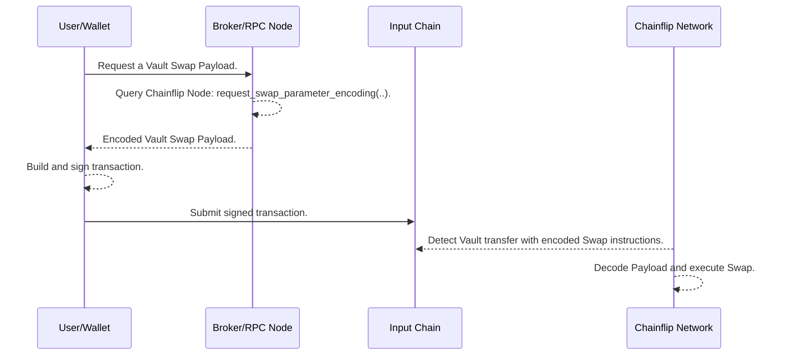

---

title: Vault Swaps

description: How to use vault swaps for integration purposes.

---

import { Callout } from "@/components";

## Vault Swaps

As described so far, initiating a swap involves requesting a deposit address and sending funds to that deposit address to trigger the swap. Here we introduce an alternative way to initiate swaps on Chainflip by making a direct deposit to the Chainflip Vault.

<Callout type="info">
Learn more in [How Swapping Works](/swapping/how-swapping-works.mdx).
</Callout>

### Pros and Cons

With some minor exceptions noted below, Vault Swaps support the same features as those initiated via [Deposit Channels](/concepts/swaps-amm/deposit-channels-and-brokers.mdx#deposit-channels).

The major benefit of a Vault Swap is that it can be presented to the end-user for submission almost immediately, whereas creation of a deposit channel requires first submitting a transaction to the Chainflip network, and waiting for finality, which can take up to 18 seconds.

The downsides of Vault Swaps are:
- A Vault Swap transaction is single-use, whereas deposit channels can be used multiple times once opened.
- A Vault Swap transaction is more complex than a simple transfer to a deposit channel, making integration more challenging and possibly incurring higher fees for Swappers.
- Cross-chain-messaging from Bitcoin is not supported for Vault Swaps.
- At the time of writing (`v1.8`), Vault Swaps are not supported on Polkadot.

## How It Works

At a high level, submitting a Vault Swap is quite simple:

1. Request the encoded Vault Swap through a Broker or RPC node.
2. Build a transaction with the returned data.
3. Sign and submit the transaction to the source chain.

<Callout type="info">
Each of Chainflip's supported chains encodes data differently. Integrators should read the following sections carefully and familiarize themselves with the specifics of each chain they want to interact with.
</Callout>

### Step 1: Request the Encoded Parameters

This step is similar to opening a deposit channel: the request must specify the source and destination assets and other swap execution parameters. For a full list of arguments please refer to the API reference: The RPC call that builds the encoded the transaction data is [request_swap_parameter_encoding](../../running-a-broker/broker-api/#broker_request_swap_parameter_encoding).

<Callout type="info">
Note there are two variants of this RPC call:
- `broker_request_swap_parameter_encoding` is exposed by the Broker API.
- `cf_request_swap_parameter_encoding` is exposed by the Chainflip Node.

Both of the above behave identically, the only difference is that the `cf_` variant requires the `broker_id` field to be populated explicitly, whereas the `broker_` variant adds the ID configured in the Broker API.
</Callout>

### Step 2: Build the Transaction

The RPC call will return the swap parameters encoded in a format specific to the *source* chain, ie. the chain on which the swap *source* asset will be sent. For example, for a SOL->BTC swap, the encoding will be Solana-specific.

For detailed instructions of how to interpret the value returned by this RPC call, please refer to individual sections for each chain:

- [Bitcoin](./bitcoin.mdx)
- [Ethereum or Arbitrum](./evm.mdx)
- [Solana](./solana.mdx)

### Step 3: Sign and Submit

The resultant transaction can be signed and submitted to the source chain, and will be detected by Chainflip validators. The swap parameters will be decoded, triggering a swap on the Chainflip network.

### Overview

This sequence diagram provides an overview of the process described above.

## Payload expiry

Payloads and therefore transactions for Vault swaps are valid for long periods of time and in some cases indefinitely. However, it is strongly recommended to only sign and broadcast freshly encoded payloads and to never rely on previous unused payloads.
