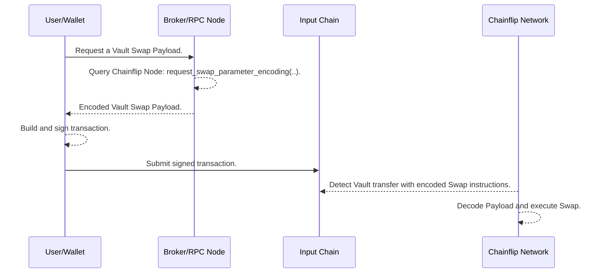

---

title: Vault Swaps

description: How to use vault swaps for integration purposes.

---

import { Callout } from "@/components";

## Vault Swaps

As described so far, initiating a swap involves requesting a deposit address and sending funds to that deposit address to trigger the swap. Here we introduce an alternative way to initiate swaps on Chainflip by making a direct deposit to the Chainflip Vault.

<Callout type="info">
Learn more in [How Swapping Works](/swapping/how-swapping-works.mdx).
</Callout>

### Pros and Cons

With some minor exceptions noted below, Vault Swaps support the same features as those initiated via [Deposit Channels](/concepts/swaps-amm/deposit-channels-and-brokers.mdx#deposit-channels).

The major benefit of a Vault Swap is that it can be presented to the end-user for submission almost immediately, whereas creation of a deposit channel requires first submitting a transaction to the Chainflip network, and waiting for finality, which can take up to 18 seconds.

The downsides of Vault Swaps are:
- A Vault Swap transaction is single-use, whereas deposit channels can be used multiple times once opened.
- A Vault Swap transaction is more complex than a simple transfer to a deposit channel, making integration more challenging and possibly incurring higher fees for Swappers.
- Cross-chain-messaging from Bitcoin is not supported for Vault Swaps.
- At the time of writing (`v1.8`), Vault Swaps are not supported on Polkadot.

## How It Works

At a high level, submitting a Vault Swap is quite simple:

1. Request the encoded Vault Swap through a Broker or RPC node.
2. Build a transaction with the returned data.
3. Sign and submit the transaction to the source chain.

<Callout type="info">
Each of Chainflip's supported chains encodes data differently. Integrators should read the following sections carefully and familiarize themselves with the specifics of each chain they want to interact with.
</Callout>

### Step 1: Request the Encoded Parameters

This step is similar to opening a deposit channel: the request must specify the source and destination assets and other swap execution parameters. For a full list of arguments please refer to the API reference: The RPC call that builds the encoded the transaction data is [request_swap_parameter_encoding](../../running-a-broker/broker-api/#broker_request_swap_parameter_encoding).

<Callout type="info">
Note there are two variants of this RPC call:
- `broker_request_swap_parameter_encoding` is exposed by the Broker API.
- `cf_request_swap_parameter_encoding` is exposed by the Chainflip Node.

Both of the above behave identically, the only difference is that the `cf_` variant requires the `broker_id` field to be populated explicitly, whereas the `broker_` variant adds the ID configured in the Broker API.
</Callout>

### Step 2: Build the Transaction

The RPC call will return the swap parameters encoded in a format specific to the *source* chain, ie. the chain on which the swap *source* asset will be sent. For example, for a SOL->BTC swap, the encoding will be Solana-specific.

For detailed instructions of how to interpret the value returned by this RPC call, please refer to individual sections for each chain:

- [Bitcoin](./bitcoin.mdx)
- [Ethereum or Arbitrum](./evm.mdx)
- [Solana](./solana.mdx)

### Step 3: Sign and Submit

The resultant transaction can be signed and submitted to the source chain, and will be detected by Chainflip validators. The swap parameters will be decoded, triggering a swap on the Chainflip network.

### Overview

This sequence diagram provides an overview of the process described above.



## Payload expiry

Payloads and therefore transactions for Vault swaps are valid for long periods of time and in some cases indefinitely. However, it is strongly recommended to only sign and broadcast freshly encoded payloads and to never rely on previous unused payloads.

---

## [TODO: MOVE EVERYTHING BELOW HERE TO ITS OWN PAGE]


### References

#### Input parameters

| Parameter | Description | Data Type |
|-----------|-------------|-----------|
| source_asset | Input asset for the swap | `Asset` |
| destination_asset | Output asset for the swap | `Asset` |
| destination_address | Destination address the swap is paid out to | `AddressString` |
| broker_commission | Broker commission in Basis point | `u16` |
| extra_parameters | Chain specific extra parameters. For details see each chain's dedicated page | `VaultSwapExtraParametersRpc` |
| channel_metadata | Optional: Information for CCM | `Option<CcmChannelMetadata>` |
| boost_fee | Optional: Boost fee for the swap ingress  | `Option<u16>` |
| affiliate_fees | Optional: A list of affiliates and their fees | `Option<Affiliates<AccountId32>>` |
| dca_parameters | Optional: Parameters for DCA swaps | `Option<DcaParameters>` |


#### Type References 

The following are references for the Types used in Vault Swap calls. This can be used for references when building your RPC call.

```rust
/// For CCM message
pub struct CcmChannelMetadata {
	/// A Vec of bytes with maximum length of 15_000. `BoundedVec<u8, ConstU32<15_000>>`
	pub message: CcmMessage,
	/// User funds designated to be used for gas.
	pub gas_budget: GasAmount,
	/// Additional parameters for the cross chain message. Only used for Solana CCMs 
	/// A Vec of bytes with maximum length of 1_000. `BoundedVec<u8, ConstU32<1_000>>`
	pub ccm_additional_data: CcmAdditionalData,
}

/// Bounded vec of affiliates and fees in Basis Points. Max size of 5
pub type Affiliates<Id> = BoundedVec<Beneficiary<Id>, ConstU32<MAX_AFFILIATES>>;

pub struct Beneficiary<Id> {
	pub account: Id,
	pub bps: u16,
}

/// Parameters for DCA
pub struct DcaParameters {
	/// The number of individual swaps to be executed
	pub number_of_chunks: u32,
	/// The interval in blocks between each swap.
	pub chunk_interval: u32,
}
```

#### Supported Chain and Asset Notation

Chainflip uses its own notation for chain and token within our Vault smart contracts. These are the values for the source and destination chains and assets parameters described above. The same values apply for the the corresponding testnets (e.g. Ethereum mainnet and Sepolia share the same value).

| Asset   | Chain      |  Asset ID  |   | Chain      | Chain ID |
| ------- | ---------- |  --------  | - | ---------- |  ------- |
| ETH     | Ethereum   |  1         |   | Ethereum   | 1        |
| FLIP    | Ethereum   |  2         |   | Polkadot   | 2        |
| USDC    | Ethereum   |  3         |   | Bitcoin    | 3        |
| DOT     | Polkadot   |  4         |   | Arbitrum   | 4        |
| BTC     | Bitcoin    |  5         |   | Solana     | 5        |
| arbETH  | Arbitrum   |  6         |   |            |          |
| arbUSDC | Arbitrum   |  7         |   |            |          |
| USDT    | Ethereum   |  8         |   |            |          |
| SOL     | Solana     |  9         |   |            |          |
| solUSDC | Solana     |  10        |   |            |          |


---

#### Chainflip parameters (`cf_parameters`)

<Callout type="info">
This section is only relevant if you want to encode EVM and Solana Vault swap transactions manually instead of using the provided RPC helpers.
If you use the `broker_request_swap_parameter_encoding` RPC call to build the call, this field is automatically encoded for you. 
</Callout>

As described in the [EVM smart contract interface](./evm.mdx#vault-contract-interface-references) and  the [Solana program interface](./solana.mdx#parameter-reference-for-the-program-call), the `cf_parameters` must be passed as part of the transaction data. The protocol expects a `VersionedCfParameters` encoded into bytes format using Parity's Scale.

```rust 
#[derive(Encode, Decode)]
pub enum VersionedCfParameters<CcmData = ()> {
	V0(CfParameters<CcmData>),
}

/// By default, the CfParameters do not contain CCM message. Therefore the CcmData is the () type.
#[derive(Encode, Decode, MaxEncodedLen, TypeInfo, Clone, PartialEq, Debug)]
pub struct CfParameters<CcmData = ()> {
	/// CCMs may require additional data (e.g. CCMs to Solana requires a list of addresses).
	pub ccm_additional_data: CcmData,
	pub vault_swap_parameters: VaultSwapParameters,
}

/// If CCM is included as part of the Vault Swap, additional data should be included here.
/// Additional data is Byte array with a maximum size of 1_000. See below for more details.
pub type VersionedCcmCfParameters = VersionedCfParameters<CcmAdditionalData>;
pub type CcmAdditionalData = BoundedVec<u8, ConstU32<1_000>>;

#[derive(Encode, Decode, MaxEncodedLen, TypeInfo, Clone, PartialEq, Debug)]
pub struct VaultSwapParameters {
  // Refund parameter, using Chainflip's internal `ForeignChainAddress` address format.
	pub refund_params: ChannelRefundParametersDecoded,
  // DCA parameters. See Vault Swaps page for its type reference.
	pub dca_params: Option<DcaParameters>,
	pub boost_fee: u8,
  // List of accounts and amount of fees to pay to (in BasisPoint)
	pub broker_fee: Beneficiary<AccountId>,
  // List of Affiliates to pay fees to.
	pub affiliate_fees: BoundedVec<AffiliateAndFee, ConstU32<5>>,
}
```

Here is an encoding example of the `cf_parameters` in typescript using the `scale-ts` library and some other utility functions from some other libraries. Those dependencies will be needed in your `package.json` file.

```typescript

import { bytesToHex, hexToBytes } from '@chainflip/utils/bytes';
import * as ss58 from '@chainflip/utils/ss58';
import { isHex } from '@chainflip/utils/string';
import { u32, Struct, Option, u16, u256, Bytes as TsBytes, Enum, Vector, u8 } from 'scale-ts';

const vaultSwapParametersCodec = Struct({
  refundParams: Struct({
    retryDurationBlocks: u32,
    refundAddress: Enum({
      Ethereum: TsBytes(20),
      Polkadot: TsBytes(32),
      Bitcoin: TsBytes(),
      Arbitrum: TsBytes(20),
      Solana: TsBytes(32),
    }),
    minPriceX128: u256,
  }),
  dcaParams: Option(Struct({ numberOfChunks: u32, chunkIntervalBlocks: u32 })),
  boostFee: u8,
  brokerFees: Struct({ account: TsBytes(32), commissionBps: u16 }),
  affiliateFees: Vector(Struct({ account: u8, commissionBps: u8 })),
});

const vaultCcmCfParametersCodec = Enum({
  V0: Struct({
    ccmAdditionalData: TsBytes(),
    vaultSwapParameters: vaultSwapParametersCodec,
  }),
});

const vaultCfParametersCodec = Enum({
  V0: Struct({
    vaultSwapParameters: vaultSwapParametersCodec,
  }),
});

function encodeCfParameters(
  sourceChain: 'Bitcoin' | 'Ethereum' | 'Polkadot' | 'Arbitrum' | 'Solana',
  fillOrKillParams: {
    retryDurationBlocks: number;
    refundAddress: string;
    minPriceX128: string;
  },
  brokerFees: {
    account: string;
    commissionBps: number;
  },
  ccmAdditionalData?: string | undefined,
  boostFeeBps?: number,
  dcaParams?: {
    numberOfChunks: number;
    chunkIntervalBlocks: number;
  },
  affiliateFees?: {
    account: number;
    commissionBps: number;
  }[],
): string {
  const vaultSwapParameters = {
    refundParams: {
      retryDurationBlocks: fillOrKillParams.retryDurationBlocks,
      refundAddress: {
        tag: sourceChain,
        value: hexToBytes(fillOrKillParams.refundAddress as `0x${string}`),
      },
      minPriceX128: BigInt(fillOrKillParams.minPriceX128),
    },
    dcaParams,
    boostFee: boostFeeBps ?? 0,
    brokerFees: {
      account: isHex(brokerFees.account)
        ? hexToBytes(brokerFees.account)
        : ss58.decode(brokerFees.account).data,
      commissionBps: brokerFees.commissionBps,
    },
    affiliateFees: affiliateFees ?? [],
  };

  return bytesToHex(
    ccmAdditionalData !== undefined
      ? vaultCcmCfParametersCodec.enc({
          tag: 'V0',
          value: {
            ccmAdditionalData: hexToBytes(ccmAdditionalData as `0x${string}`),
            vaultSwapParameters,
          },
        })
      : vaultCfParametersCodec.enc({
          tag: 'V0',
          value: {
            vaultSwapParameters,
          },
        }),
  );
}

```

