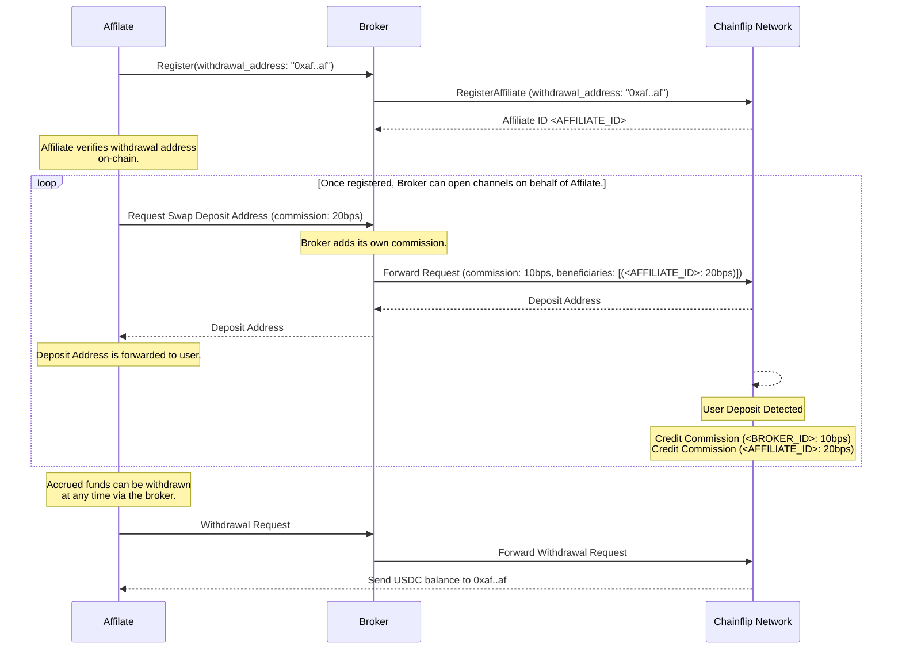

---

title: Affiliates

description: Affiliates is a feature which allows brokers to share commission.

---

import { Callout } from "@/components";

# Affiliates

<Callout type="warning">From version 1.8, the way Affiliates work has changed. If you currently manage any Affilate relationships, please read this page carefully. Legacy-style Affiliate account will continue to work but should be considered deprecated. Existing Affiliates can still withdraw earnings as before using the regular [asset withdrawal API](broker-api#broker_withdraw_fees). Nonetheless, we recommend migrating existing Affiliate accounts to the new fully-delegated account type.</Callout>

<Callout type="info">This documentation is for Brokers who want to onboard Affilates. If you are interested in *becoming* an Affiliate, please contact us on Discord and we will put you in touch with a Broker.</Callout>

## Terminology

To begin with, let's define the following terms to be on the same page when talking about Affiliates:

- **Broker**: A Chainflip account registered as a Broker.
- **Fully-Delegated Affiliate**: These affiliate accounts are *fully-delegated* - the affiliate delegates all Chainflip interactions to the **Broker** and cannot interact with the Chainflip network directly.
- **Legacy Affiliate**: These accounts are partially delegated - the affiliate could request that a **Broker** opens channels on its behalf, but was still required to create and register their own account in order to withdraw any earnings. **This type of affiliate becomes deprecated in 1.8**.
- **Beneficiary**: A Chainflip account that receives a share of a commission. Can be an Affiliate or another Broker.

## What is an Affiliate?

An Affiliate is usually some service provider that wishes to offer Chainflip swaps to its users, but doesn't want the overhead of interacting directly with the network. Instead, the Affiliate will interact with a Broker, and the Broker will interact with the Chainflip network on the Affiliate's behalf. The benefits to the Affiliate are lower operational overhead and simpler integration. The benefit to the Broker is that they can charge a commission in exchange for this service.

## Affiliates in Depth

You can think of an Affiliate as a "passive" sub-account controlled by the Broker. Nobody has the private key to the account, and the only way to access the funds owned by the account is via the Broker who created it.

Since the Affiliate's earnings are controlled by the Broker, we need a way to ensure that the Broker cannot steal or lose the Affiliate's funds. In other words, the Broker must not be the custodian of the funds. For this reason, Brokers are required to [*register*](broker-api#broker_register_affiliate) Affiliates on-chain with an associated **Ethereum** mainnet address, which will function as the withdrawal address for earned commission.

Each Affiliate is assigned a unique Chainflip address, indistinguishable from any other address. Once created, the Affiliate registration cannot be changed.

<Callout type="info">
All Affiliate commission is earned in USDC and can only be withdrawn by the Broker to the registered Ethereum withdrawal address. 
</Callout>

Each Broker can register up to 256 Affiliates.

After the Affiliate has been registered, the Affiliate can verify the withdrawal address by submitting an rpc request to an rpc node. This will return a list of Affiliates registered to that broker, including the withdrawal address associated with each Affiliate. For example:

```bash
% curl -H "Content-Type: application/json" \
-d '{
    "jsonrpc":"2.0",
    "id":1,
    "method":"cf_get_affiliates",
    "params": ["cFJw6hEu8yJVY84dQcKwLdKgXU4PejaTfkoyfNW28n6XyEec1"]
    }' \
https://mainnet-rpc.chainflip.io

{"jsonrpc":"2.0","result":[["cFNGCP7MUJCbRyktHizaYnEekiTAPp1Sgopsbt99FNWc6Q1LU",{"short_id":0,"withdrawal_address":"0xe646ff46ce321cf9259caa01bcc71b54a333732c"}]],"id":1}
```

Alternatively, the Affiliate can check a via a public block explorer such as [polkadot.js.org](https://polkadot.js.org/apps/?rpc=wss%3A%2F%2Fmainnet-archive.chainflip.io#/explorer). Navigate to to `Developer > Chain State` and under `selected state query` choose `swapping > affilateAccountDetails`. Enter the Broker's and Affiliate's Account IDs and submit. The returned data will contain the associated withdrawal address.

## How Commission Works

When submitting a request to open a Swap Deposit Channel, or when building a [Vault Swap](swapping/integrations/advanced/vault-swaps) payload, a Broker can specify a list of additional *Beneficiaries*, each with their own commission rate. When a swap is executed via a Deposit Channel, the broker and each beneficiary will earn the rates specified when the channel was opened. In the case of Vault Swaps, the commission rates are encoded directly in the vault payload. 

<Callout type="info">
For deposit channels **only**, the Beneficiary can also be another Broker.
</Callout>

See the [API documentation](broker-api) to learn more about deposit channel management.

## Example

This sequence diagram shows the entire flow, from registration through submission of swaps, to withdrawal.



## Legacy Affiliate Accounts

Prior to the 1.8 release, Affiliates were required to register accounts as Brokers in order to access their earned commission. This method will continue to function as before via Beneficiary system. *However* legacy-style Affiliate accounts **cannot** be Beneficiaries of [Vault Swaps](swapping/integrations/advanced/vault-swaps).

In order to benefit from Vault Swaps and other features, such as Broker initiated withdrawals, or auto-withdrawals (coming in a future realease), it is recommended that brokers create new fully-delegated Affiliate accounts for their existing Affiliates.
